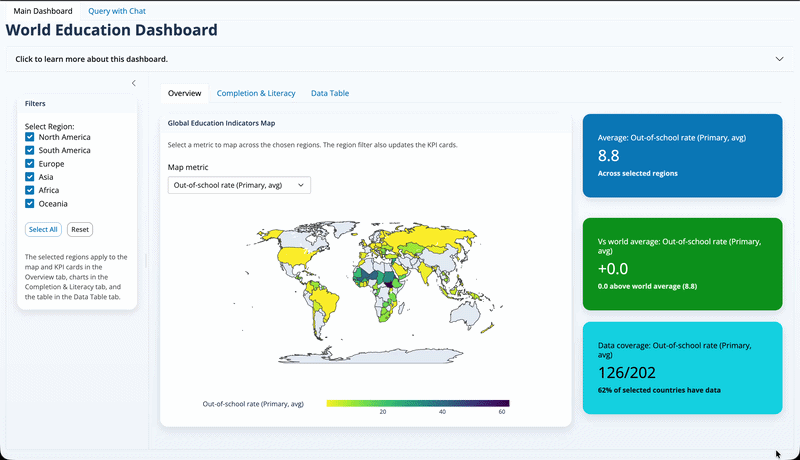

# World Education Dashboard

## Motivation

Education systems vary dramatically across the world, and understanding which factors contribute to better educational outcomes is crucial for policymakers, researchers, and educators. This dashboard addresses the challenge of making sense of complex global education data by providing an interactive visualization tool that enables users to:

- Explore education indicators across 202 countries
- Compare regional performance and identify disparities
- Analyze gender gaps in education access and completion
- Make data-driven decisions to improve education systems globally

The dashboard leverages data from UNESCO Institute for Statistics, UNICEF, and UN Statistics Division to provide comprehensive insights into global education patterns.

## Demo



## Features

- **Interactive World Map**: Visualize education indicators globally with color-coded choropleth maps
- **Regional Filtering**: Focus analysis on specific continents
- **Gender Analysis**: Compare male and female education outcomes across multiple metrics
- **Completion Rate Tracking**: Monitor student progression from primary through upper secondary education
- **Literacy Comparison**: Analyze youth literacy rates by gender and region
- **KPI Cards**: Quick insights into primary completion rates and gender disparities
- **Data Table**: Detailed country-level data for transparency and further analysis

## Live Dashboard

Access the deployed dashboard here:

- [World Education Dashboard (Production)](https://sapolraadnui-worldeducation.share.connect.posit.cloud)
- [World Education Dashboard (Development)](https://sapolraadnui-worldeducation-dev.share.connect.posit.cloud/)

## For Contributors

### Installation

#### Option 1: Using Conda (Recommended)

```bash
# Clone the repository
git clone https://github.com/UBC-MDS/DSCI-532_2025_15_WorldEducation.git
cd DSCI-532_2025_15_WorldEducation

# Create and activate the conda environment
conda env create -f environment.yml
conda activate 532
```

#### Option 2: Using pip

```bash
# Clone the repository
git clone https://github.com/UBC-MDS/DSCI-532_2025_15_WorldEducation.git
cd DSCI-532_2025_15_WorldEducation

# Create a virtual environment (optional but recommended)
python -m venv venv
source venv/bin/activate  # On Windows: venv\Scripts\activate

# Install dependencies
pip install -r requirements.txt
```

### Running the App Locally

```bash
# Make sure you're in the project root directory
# Run the Shiny app
shiny run src/app.py
```

The dashboard will be available at `http://localhost:8000` (or the port shown in your terminal).

### Project Structure

```
.
├── data/
│   ├── raw/                    # Original dataset
│   └── processed/              # Processed data for the app
├── notebooks/                  # Exploratory data analysis
├── src/
│   ├── app.py                  # Main Shiny application
│   └── process_data.py         # Data processing scripts
├── report/                     # Project documentation and specs
├── img/                        # Images and demo files
├── requirements.txt            # Python dependencies
├── environment.yml             # Conda environment specification
└── README.md                   # This file
```

### Contributing

We welcome contributions! Please see [CONTRIBUTING.md](CONTRIBUTING.md) for guidelines on how to contribute to this project.

### Testing

To test the dashboard make sure you have installed the required libraries as shown above.

cd to the dashboard root directory and run:
```
 pytest
```

## Data Source

The dataset is sourced from [Kaggle - World Educational Data](https://www.kaggle.com/datasets/nelgiriyewithana/world-educational-data/data), compiled from UNESCO Institute for Statistics, UNICEF, and UN Statistics Division.

## License

See [LICENSE](LICENSE) for details.

## Team

See [team.txt](team.txt) for team member information.