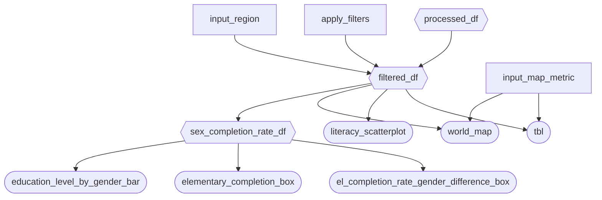

## Phase 2: App Specification (`reports/m2_spec.md`)

### 2.1 Updated Job Stories

| #   | Job Story                                                                                                                                                   | Status         | Notes                                                              |
| --- | ----------------------------------------------------------------------------------------------------------------------------------------------------------- | -------------- | ------------------------------------------------------------------ |
| 1   | When I am evaluating the overall performance of education systems across countries, I want to compare key education indicators such as completion rates and literacy rates across regions, so I can identify which regions are lagging behind and require targeted policy attention.     | ✅ Implemented |                                                                    |
| 2   | When designing policies to bridge gender inequality in education, I want to compare different education variables separately for male and female students across different education levels, so I can identify gender-based disparities and design policies that promote equal access to education.                | ✅ Implemented |                                                                    |
| 3   | When I am reviewing large-scale global education data, I want to visualize education indicators on a choropleth, so I can quickly detect global patterns, trends, and outlier countries that require further investigation or policy intervention.   | ✅ Implemented |                                                                    |

### 2.2 Component Inventory

| ID | Type | Shiny widget / renderer | Depends on | Job story |
|----|------|--------------------------|------------|-----------|
| `input_region` | Input | `ui.input_checkbox_group()` | — | #1, #2, #3 |
| `apply_filters` | Input | `ui.input_action_button("Apply Filters")` | — | #1, #2, #3 |
| `input_map_metric` | Input | `ui.input_select()` (grouped by theme) | — | #3 |
| `processed_df` | Reactive calc | `@reactive.Calc` | — | #1, #2, #3 |
| `filtered_df` | Reactive calc | `@reactive.Calc` + `@reactive.event(input.apply_filters)` | `processed_df`, `input_region`, `apply_filters` | #1, #2, #3 |
| `sex_completion_rate_df` | Reactive calc | `@reactive.Calc` (melt + group mean by Sex & Education_Level) | `filtered_df` | #1, #2 |
| `world_map` | Output | `@render_widget` (Plotly choropleth) | `filtered_df`, `input_map_metric` | #3 |
| `literacy_scatterplot` | Output | `@render_plotly` (scatter plot) | `filtered_df` | #1, #2 |
| `education_level_by_gender_bar` | Output | `@render_plotly` (grouped bar chart) | `sex_completion_rate_df` | #1, #2 |
| `elementary_completion_box` | Output | `@render.ui` (value_box KPI) | `sex_completion_rate_df` | #1, #2 |
| `el_completion_rate_gender_difference_box` | Output | `@render.ui` (value_box KPI) | `sex_completion_rate_df` | #2 |
| `tbl` | Output | `@render.data_frame` (DataGrid) | `filtered_df`, `input_map_metric` | #1, #2, #3 |

### 2.3 Reactivity Diagram

Verify your diagram satisfies the reactivity requirements in Phase 3.2 before you start coding.

### 2.4 Calculation Details

For each `@reactive.calc` in your diagram, briefly describe:

-   Which inputs it depends on.
-   What transformation it performs (e.g., "filters rows to the selected year range and region(s)").
-   Which outputs consume it.

1.  **processed_df**

    -   The only input is the original data frame; however, additional columns will be added as follows:

        -   Literacy_Gap = **Youth_15_24_Literacy_Rate_Male-Youth_15_24_Literacy_Rate_Female**

        -   Completion_Gap\_\*\*\* = Completion_Rate\_\*\*\***\_Male - Completion_Rate\_**\*\*\*\_Female

            -   \*\*\* : Primary/Lower_Secondary/Upper_Secondary

        -   Aggregates (regardless of genders) = (Completion_Rate\_\*\*\***\_Male + Completion_Rate\_**\*\*\*\_Female)/2

    <!-- -->

    -   The result is consumed by filtered_df and output_world_map

2.  **filtered_df**

    -   The inputs are processed_df and input_regions

    -   The transformation is to filter rows to only countries in the selected regions. All the columns remain

    -   The result is consumed by output_literacy_scatter, output_tbl, and regional_summary

3.  **regional_summary**

    -   The inputs are filtered_df and input_completion_levels

    -   The transformation is to summarize statistics for selected regions such as means/medians/standard deviations

    -   The result is consumed by output_completion_chart (diverging bar chart) and output_insight_card (KPI report)
