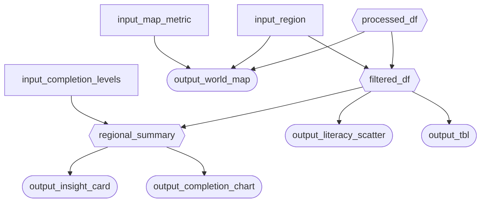

## Phase 2: App Specification (`reports/m2_spec.md`)

### 2.1 Updated Job Stories

| #   | Job Story                                                                                                                                                   | Status         | Notes                                                              |
| --- | ----------------------------------------------------------------------------------------------------------------------------------------------------------- | -------------- | ------------------------------------------------------------------ |
| 1   | When I am evaluating the overall performance of education systems across countries, I want to compare key education indicators such as completion rates and literacy rates across regions, so I can identify which regions are lagging behind and require targeted policy attention.     | ✅ Implemented |                                                                    |
| 2   | When designing policies to bridge gender inequality in education, I want to compare different education variables separately for male and female students across different education levels, so I can identify gender-based disparities and design policies that promote equal access to education.                | ✅ Implemented |                                                                    |
| 3   | When I am reviewing large-scale global education data, I want to visualize education indicators on a choropleth, so I can quickly detect global patterns, trends, and outlier countries that require further investigation or policy intervention.   | ✅ Implemented |                                                                    |

### 2.2 Component Inventory

Plan every input, reactive calc, and output your app will have. Use this as a checklist during Phase 3. Minimum **2 components per team member** (6 for a 3-person team, 8 for a 4-person team), with **at least 2 inputs and 2 outputs**:

+-------------------------+---------------+--------------------------------------------------------------------------------+-----------------------------------------------+------------+
| ID                      | Type          | Shiny widget / renderer                                                        | Depends on                                    | Job story  |
+=========================+===============+================================================================================+===============================================+============+
| input_region            | Input         | ui.input_selectize(multiple=True)                                              | \-                                            | #1, #2, #3 |
+-------------------------+---------------+--------------------------------------------------------------------------------+-----------------------------------------------+------------+
| input_map_metric        | Input         | ui.input_select() (grouped by theme: Access / Completion / Learning / Context) | \-                                            | #3         |
+-------------------------+---------------+--------------------------------------------------------------------------------+-----------------------------------------------+------------+
| input_completion_levels | Input         | ui.input_checkbox_group() (Primary / Lower / Upper Secondary)                  | \-                                            | #1, #2     |
+-------------------------+---------------+--------------------------------------------------------------------------------+-----------------------------------------------+------------+
| processed_df            | Reactive calc | `@reactive.calc`                                                               | \-                                            | #1, #2, #3 |
+-------------------------+---------------+--------------------------------------------------------------------------------+-----------------------------------------------+------------+
| filtered_df             | Reactive calc | `@reactive.calc`                                                               | input_region, processed_df                    | #1, #2, #3 |
+-------------------------+---------------+--------------------------------------------------------------------------------+-----------------------------------------------+------------+
| regional_summary        | Reactive calc | `@reactive.calc`                                                               | filtered_df, input_completion_levels          | #1, #2     |
+-------------------------+---------------+--------------------------------------------------------------------------------+-----------------------------------------------+------------+
| output_insight_card     | Output        | \@render.ui                                                                    | regional_summary                              | #1         |
+-------------------------+---------------+--------------------------------------------------------------------------------+-----------------------------------------------+------------+
| output_world_map        | Output        | \@render_plotly (choropleth)                                                   | processed_df, input_map_metric, input_regions | #3         |
+-------------------------+---------------+--------------------------------------------------------------------------------+-----------------------------------------------+------------+
| output_completion_chart | Output        | \@render.plot (diverging bar chart)                                            | regional_summary                              | #1, #2     |
+-------------------------+---------------+--------------------------------------------------------------------------------+-----------------------------------------------+------------+
| output_literacy_scatter | Output        | \@render.plot (scatter plot)                                                   | filtered_df                                   | #1, #2     |
+-------------------------+---------------+--------------------------------------------------------------------------------+-----------------------------------------------+------------+
| output_tbl              | Output        | \@render.data_frame                                                            | filtered_df                                   | #1, #2, #3 |
+-------------------------+---------------+--------------------------------------------------------------------------------+-----------------------------------------------+------------+

### 2.3 Reactivity Diagram

Draw your planned reactive graph as a [Mermaid](https://mermaid.js.org/) flowchart using the notation from Lecture 3:

-   `[/Input/]` (Parallelogram) (or `[Input]` Rectangle) = reactive input
-   Hexagon `{{Name}}` = `@reactive.calc` expression
-   Stadium `([Name])` (or Circle) = rendered output

Example:

```` markdown

````

Verify your diagram satisfies the reactivity requirements in Phase 3.2 before you start coding.

### 2.4 Calculation Details

For each `@reactive.calc` in your diagram, briefly describe:

-   Which inputs it depends on.
-   What transformation it performs (e.g., "filters rows to the selected year range and region(s)").
-   Which outputs consume it.

1.  **processed_df**

    -   The only input is the original data frame; however, additional columns will be added as follows:

        -   Literacy_Gap = **Youth_15_24_Literacy_Rate_Male-Youth_15_24_Literacy_Rate_Female**

        -   Completion_Gap\_\*\*\* = Completion_Rate\_\*\*\***\_Male - Completion_Rate\_**\*\*\*\_Female

            -   \*\*\* : Primary/Lower_Secondary/Upper_Secondary

        -   Aggregates (regardless of genders) = (Completion_Rate\_\*\*\***\_Male + Completion_Rate\_**\*\*\*\_Female)/2

    <!-- -->

    -   The result is consumed by filtered_df and output_world_map

2.  **filtered_df**

    -   The inputs are processed_df and input_regions

    -   The transformation is to filter rows to only countries in the selected regions. All the columns remain

    -   The result is consumed by output_literacy_scatter, output_tbl, and regional_summary

3.  **regional_summary**

    -   The inputs are filtered_df and input_completion_levels

    -   The transformation is to summarize statistics for selected regions such as means/medians/standard deviations

    -   The result is consumed by output_completion_chart (diverging bar chart) and output_insight_card (KPI report)
